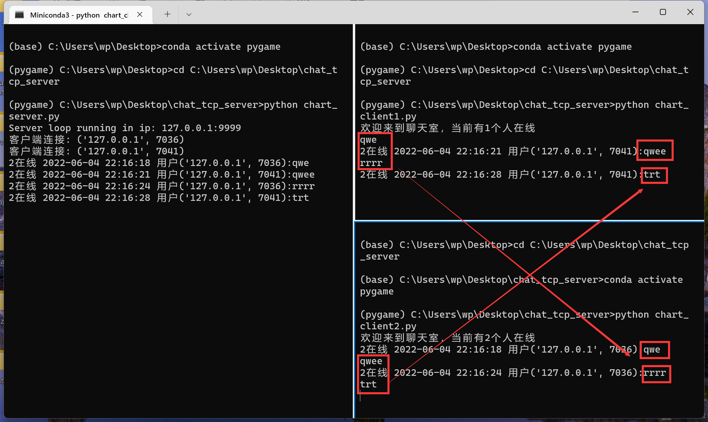

# chat_tcp_server
- 极简多人在线聊天服务器客户端
- 使用 scoket，支持多人同时连接进行聊天
- 一个人发送消息的时候，消息广播的所有在线的客户端上

# 不足之处

- 可以参考other里面的
  - 写一个grpc的协议，来规定发送过程中的消息
  - 一个请求有请求头，请求体，每个请求体有长度，需要写在请求头上
- 客户端可以写成只接受来着服务器的信息，发送的话另外请求服务器
- 可以考虑加上线程锁，具体的参考other里面的例子